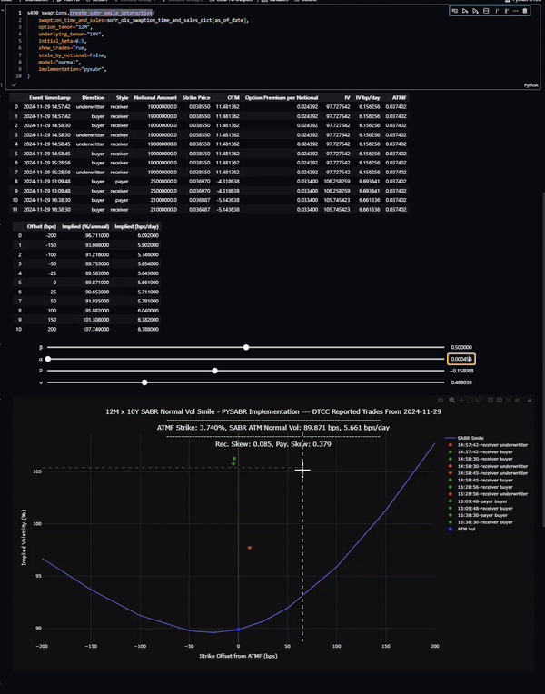

# Curvy-CUSIPs

Using Open Sourced Data for Rates Trading examples in Python:

- Cash Treasuries: [FedInvest EOD Markings](https://www.treasurydirect.gov/GA-FI/FedInvest/selectSecurityPriceDate)
- Swaps/Swaptions: [DTCC SDR](https://pddata.dtcc.com/ppd/cftcdashboard), [BBG SEF](https://data.bloombergsef.com/)
- SOFR OIS Curve: [Eris SOFR Swap Futures FTP](https://files.erisfutures.com/ftp/)
- Economics/Misc: [FRED](https://fred.stlouisfed.org/), [NYFRB](https://markets.newyorkfed.org/static/docs/markets-api.html)

## To get started:

Clone repo:
```
git clone https://github.com/yieldcurvemonkey/Curvy-CUSIPs.git
```

pip install dependencies: 
```
pip install -r requirements.txt
```

cd into scripts dir:
```
cd .\Curvy-CUSIPs\scripts
```

Init Cash Treasuries DBs: 

```
python update_ust_cusips_db.py init
```

- This will take 30-60 minutes
- This will create 6 databases
    - ust_cusip_set
    - ust_cusip_timeseries
    - ust_eod_ct_yields
    - ust_bid_ct_yields
    - ust_mid_ct_yields
    - ust_offer_ct_yields

- Data is source from FedInvest
- Data availability: daily bid, offer, mid prices and ytms at cusip level (and cusip characteristics) starting from late 2008
- Script, by default, fetches data starting from 2018
- See below for examples

Update Cash Treasuries DBs: 

```
python update_ust_cusips_db.py
```

Init SOFR OIS Curve DB:

```
python update_sofr_ois._db.py init
```

- This will take 30-60 minutes
- This will create one database: nyclose_sofr_ois
- Curve marking from < 2024-01-12 is from the BBG 490 Curve, newer EOD markings are sourced from the Eris FTP
- See below for examples

Update SOFR OIS Curve DB:
```
python update_sofr_ois._db.py
```

## Checkout examples in `\notebooks`:

### usts_basics.ipynb
- Yield Curve Plotting
- CT Yields Dataframe
- CUSIP look up
- CUSIP plotting
- Spread, Flies plotting

### usts_basics.ipynb
- SOFR OIS Curve Ploting
- SOFR OIS Swap Spreads
- Spread, Flies plotting
- Swap Fwds

### sabr_smile.ipynb



### More examples/notebooks coming soon